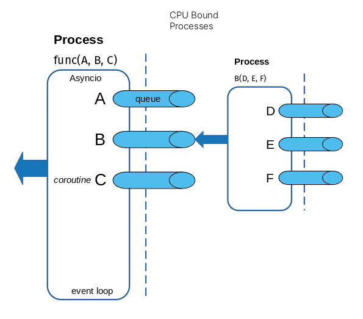

A python native parallel processing framework based on simple decorators.

## Overview

Entangle is a new kind of parallel compute framework for large multi-core HPC environments. 
It allows for simple workflow design using *plain old python* and special decorators that control the type of parallel compute needed.

One key feature of entangle is fine-grained control over individual functions in a workflow. You could easily describe multiple functions running across multiple compute environments all interacting as if they were simple local python functions.
No central scheduler or workflow manager is needed.

## Architecture

Entangle is designed without a central scheduler or workflow manager. Rather, each function is decorated with special descriptors that turn them into their own workflow managers.
These *decorators* implement logic to parallelize and *gather* values from its dependent arguments, which are executed as sub-processes. As each function is assigned a dedicated CPU, the workflow is thus an ensemble of parallel, independent micro-flows that resolve themselves and pass their values up the chain until the workflow completes.

This offers an extreme *shared nothing* design that maximizes CPU usage in a multi-CPU environment.

Each function (or task) is given a process and schedule to a CPU by the operating. Since python Processes are native bound OS processes. This allows us to use the benefits of the operating system scheduler which is optimized for the underlying hardware.
Arguments that satisfy the function are run in parallel in the same fashion. The parent function then uses asyncio coroutines to monitor queues for the results from the processes. This keeps the CPU usage down while the dependent functions produce their results.



### Tradeoffs

Every design approach is a balance of tradeoffs. Entangle favors CPU utilization and parallelism over resource managers, schedulers or other shared services.
It favors simplicity over behavior, attempting to be minimal and un-opinionated. It tries to be *invisible* to the end user as much as possible. It strives for the basic principle that, *"if it looks like it should work, it should work."*

Entangle leans on the OS scheduler to prioritize processes based on the behavior of those processes and underlying resource utilizations. It therefore does not provide its own redundant scheduler or task manager.

### Use Cases

Because of these tradeoffs, there are certain use cases that align with entangle and others that probably do not.

If you have lots of CPUs, entangle could be for you! If you want easy python workflows that span local and remote cloud resources, entangle could be for you.
If you want to write custom handlers that enrich or execute code in custom ways for your needs, entangle makes this easy for you.

## Install

From repo root

```shell

(venv) $ pip3 install pipenv
(venv) $ pipenv install --dev
(venv) $ pipenv run pytest

```
## Example
An example of how entangle will be used (still in development)
```python

from entangle.process import process
from entangle.thread import thread
from entangle.task import task
from entangle.local import local
from entangle.aws import aws
from entangle.aws.ec2 import ec2
from entangle.aws.lmbda import lmbda

@process
@local(cpus=4)
def add(a, b):
    return a + b

@process
@aws(keys=[])
@ec2
def one():
    return 1

@thread
@local
def two():
    return 2

@lmbda(url='url')
@aws(keys=[])
def proxy():
    # lambda proxy
    pass

@process
def subtract(a, b):
    return int(a) - int(b)

@process
def five():
    return 5

@process
def num(n):
    return n

# 1,2,3 get passed to lambda function and result returned
result = proxy(1,2,3)

# parallel workflow is just "plain old python"
result = add(
            add(
                num(6),
                two() if False else one()
            ),
            subtract(
                five(),
                two()
            )
        )

print(result())

```