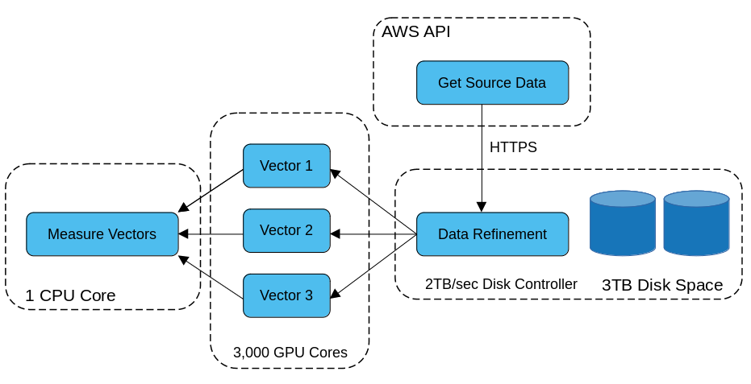
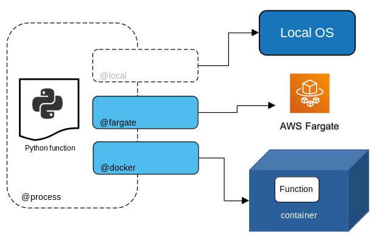
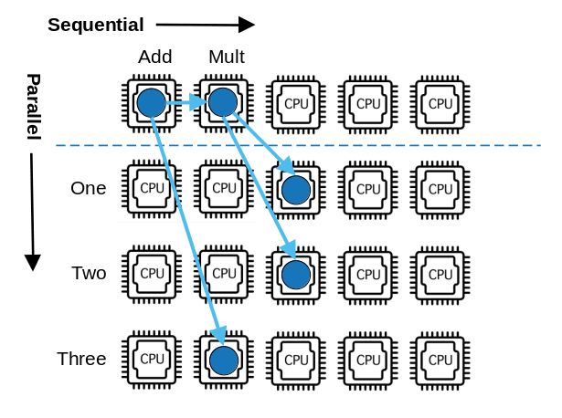
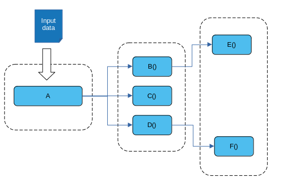
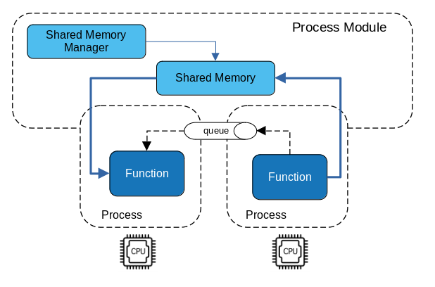
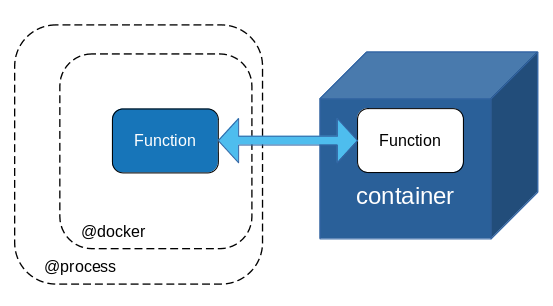

A lightweight (serverless) native python parallel processing framework based on simple decorators and call graphs.

## Outline

* [Overview](#overview)
  * [What does "Entangle" mean?](#what-does-entangle-mean)
  * [Important Notes](#important-notes)
* [Install](#install)
* [Design Goals](#design-goals)  
* [Architecture](#architecture)
* [Declarative Infrastructure](#declarative-infrastructure)
* [Execution](#execution)  
* [Composition](#composition)  
  * [Decorator Composition](#decorator-composition)
  * [Workflow Composition](#workflow-composition)
* [Containers](#containers)  
* [Dataflows](#dataflows)
  * [Dataflow vs Workflows](#dataflows-vs-workflows)
  * [DAG Dataflow](#dag-dataflow)
  * [Results Comparison](#results-comparison)
  * [Advantages of Strict Dataflow](#advantages-of-strict-dataflow)
* [Examples](#examples)
    * [GPU Example](#gpu-example)
    * [Shared Memory Example](#shared-memory-example)
    * [AI Example](#ai-example)
    * [Docker Example](#docker-example)

## Overview

Entangle is a *different* kind of parallel compute framework for multi-CPU/GPU environments. 
It allows for simple workflow design using *plain old python* and special decorators that control the type of parallel compute and infrastructure needed.

One key feature of entangle is fine-grained control over individual functions in a workflow. You could easily describe multiple functions running across multiple compute environments all interacting as if they were simple local python functions.
No central scheduler or workflow manager is needed.

Another unique quality is the use of composition to build parallel workflows dynamically.

### What does "Entangle" mean?

The term is derived from a quantum physics phenomena called *[quantum entanglement](https://en.wikipedia.org/wiki/Quantum_entanglement#:~:text=Quantum%20entanglement%20is%20a%20physical,including%20when%20the%20particles%20are)* which involves the state of a pair or group of particles affecting one another *at a distance* instantaneously.

In this context, it is a metaphor for how tasks send data (particles) to one another in the context of a connected microflow.

### Important Notes

Please keep in mind that Entangle is *in development* and there are no releases as of yet. If you clone this repo and want to experiment be sure to update often as things break, improve, get fixed etc. quite frequently on the this branch for now.
## Install

NOTE: At the moment entangle only works with python 3.8 due to how coroutines work there and also shared memory features.

From repo root

```shell

(venv) $ pip3 install pipenv
(venv) $ pipenv install --dev
(venv) $ pipenv run pytest

```
or
```shell
(venv) $ python setup.py install
(venv) $ python setup.py clean
```

### Miniconda

If you are planning to run or use GPU enabled code it is recommended to set up a `miniconda` virtualenv.

## Design Goals

* Small & Simple
* Easy to Understand
* non-API
* Plain Old Python
* True Parallelism
* Pluggable & Flexible
* Composition
* Shared-Nothing
* Serverless & Threadless
* Dataflow & Control Flow Executions

## Architecture

Entangle is designed without a central scheduler or workflow manager. Rather, each function is decorated with special descriptors that turn them into their own workflow managers.
These *decorators* implement logic to parallelize and *gather* values from its dependent arguments, which are executed as separate processes. As each function is assigned a dedicated CPU, the workflow is thus an ensemble of parallel, independent micro-flows that resolve themselves and pass their values into queues until the workflow completes.

This offers an extreme *shared nothing* design that maximizes CPU usage in a multi-CPU environment.

Each function (or task) is given a process and scheduled to a CPU by the operating system. Since python Processes are native bound OS processes, this inherits the benefit of the operating system scheduler which is optimized for the underlying hardware.
Arguments that satisfy the function are run in parallel in the same fashion. The parent function then uses asyncio coroutines to monitor queues for the results from the processes. This keeps the CPU usage down while the dependent functions produce their results and eliminates the need for monitor threads.

As a workflow executes, it fans out over CPUs. Each process acting as it's own scheduler to spawn new processes and resolve arguments, while also monitoring queues for incoming results asynchronously.
This makes the workflow a truly emergent, dynamic computing construct vs a monolithic service managing all the pieces. Of course, this is not to say one approach is better, just that entangle takes a different approach based on its preferred tradeoffs.


### Tradeoffs

Every design approach is a balance of tradeoffs. Entangle favors CPU utilization and *true* parallelism over resource managers, schedulers or other shared services.
It favors simplicity over behavior, attempting to be minimal and un-opinionated. It tries to be *invisible* to the end user as much as possible. It strives for the basic principle that, *"if it looks like it should work, it should work."*

Entangle leans on the OS scheduler to prioritize processes based on the behavior of those processes and underlying resource utilizations. It therefore does not provide its own redundant scheduler or task manager. Because of this, top-down visibility or control of workflow processes is not as easy as with centralized task managers.

Entangle prefers the non-API approach, where it looks like regular python expressions, over strict API's or invocation idioms. This makes it easier to pick up and use and plays well with 3rd party frameworks too.
### Use Cases

Because of these tradeoffs, there are certain use cases that align with entangle and others that probably do not.

If you want top-down visibility & control of workflows and tasks, Entangle is probably not ready for you.

If you have lots of CPUs, entangle could be for you! If you want easy python workflows that span local and remote cloud resources, entangle could be for you.
If you want to write custom handlers that enrich or execute code in custom ways for your needs, entangle makes this easy for you.

Entangle benefits more with CPU intensive, longer running tasks than shorter, less CPU intensive tasks.

#### Orchestration
One focused use case for entangle is when you want to orchestrate across different compute nodes, remote APIs and other disparate endpoints in a single workflow, with inherent parallelism.



Each step of the workflow has different parameters, needs and protocols used to communicate with it.
Such a workflow might simply look like:

```python
data = data_refinement(
    get_source_data()
)
result = measure_vectors(
    vector1(
        data("vector1")
    ),
    vector2(
        data("vector2")
    ),
    vector3(
        data("vector3")
    )
)
```

#### GPU Processing
Another use case is the need to run multiple parallel tasks that operate on matrix data using a GPU.
Entangle makes this quite easy as seen in [GPU Example](#gpu-example), [Docker Example](#docker-example) and [Shared Memory Example](#shared-memory-example)

#### DevOps
For devops use cases Entangle allows you to write simple, parallel workflow graphs using *plain old python*. This let's you write efficient parallel devops pipelines with ease.


### What Entangle is not

* Entangle is not inherently distributed
* Entangle does not yet perform fail over or retries
* Entangle is not a batch process framework
* Entangle is not map/reduce
* Entangle is not a centralized task manager
* Entangle does not provision or manage resources

## Declarative Infrastructure

Entangle allows you to target specific infrastructure environments or needs using simple decorators.

For example, to specify a process run on local hardware you can use the @local decorator

```python
@process
@local
def myfunc():
    return
```

If you want to execute a function in AWS EC2 or fargate, you could write it as:

```python
@process
@aws(keys=[])
@ec2(ami='ami-12345')
def myfunc():
    return

@process
@aws(keys=[])
@fargate(ram='2GB', cpu='Xeon')
def myfunc():
    return
```

or using docker containers
```python
@process
@docker(image="tensorflow/tensorflow:latest-gpu")
def reduce_sum():
    import tensorflow as tf
    return tf.reduce_sum(tf.random.normal([1000, 1000]))
```


If you have a custom on-prem environment you can write a simple decorator that deploys the task to that and use it alongside other infrastructure decorators.
## Execution

As we mentioned above, entangle workflows will fan out during execution and occupy CPUs throughout the workflow. The OS will determine the priority of processes based on their resource needs at the time of execution.
Here is a simple workflow and diagram showing how the parallel execution unfolds.

```python
result = add(
   mult(
      one(),
      two()
   ),
   three()
)
```

This execution order applies to workflows in entange. If you use `@dataflow` decorator the execution follows that of a dataflow compute model. Refer to the section [Dataflows](#dataflows) for more information.




### Threads vs Processes

In Python, threads do not execute in parallel to one another, it only gives the illusion of such. Python handles the context switching between threads and is limited by the GIL.
Processes on the other hand, are not controlled by a GIL and can thus truly run in parallel. The host operating system governs the sheduling of processes and entangle is designed to exploit this benefit.


## Process Behavior

Keyword parameters on the `@process` decorator allow you to control some meta-behavior of the process.

### Wait

Wait indicates how long a function should wait before its arguments arrive. It is a sibling to *timeout* however it is different.
```python
@process(wait=20)
def values(*args):
    values = [arg for arg in args]

    return values


o = values(
    one(),
    train()
)
```
In the above example, it is saying that the `values` function will wait up to 20 seconds for *both* `one()` and `train()` functions to complete and return values otherwise it will throw a `ProcessTimeoutException`.
### Timeout

```python

# Wait at most, 3 seconds for this task to complete
@process(timeout=3)
def task():
    return True

# Wait indefinitely for this task to complete
@process
def taskB():
    return False
```
When a process times out, a `ProcessTimeoutException` will be thrown by Entangle and the process will be terminated if it is still alive.

## Composition

Entangle offers a couple different ways to use composition effectively: with *decorators* and with *workflows*.
### Decorator Composition

You can compose your tasks by combining process and infrastructure decorators.

Again, in the example below, we are declaring a *process* and *local* infrastructure for our task to run by composing two decorators together.
```python
@process
@local
def taskA():
    return
```
or, specifying that the task run as a process inside AWS fargate, unchanged.
```python
@process
@aws(keys=[])
@fargate(ram='2GB', cpu=4)
def taskA():
    return
```
### Workflow Composition
Composing workflows is just as simple. You can write code that itself constructs workflows on the fly easily.

```python
from entangle.process import process
from entangle.http import request
from entangle.workflow import workflow


@process
@request(url='https://datausa.io/api/data', method='GET')
def mydata(data):
    import json
    data = json.loads(data)
    return int(data['data'][0]['Year'])


@process
def two():
    return 2


@process
def add(a, b):
    v = int(a) + int(b)
    print("ADD: *"+str(v)+"*")
    return v


@workflow
def workflow1():
    return add(
        mydata(drilldowns='Nation', measures='Population'),
        two()
    )


@workflow
def workflow2(value):
    return add(
        value(),
        two()
    )


result = workflow2(workflow1)

print(result())

```

The key to making this work is the *deferring of execution* trait of Entangle which we will discuss in a later post.
But essentially it allows for separation of workflow *declaration* from *execution*. Doing this allows you to treat workflows as objects and pass them around anywhere a normal python function (or workflow) is expected. Prior to execution.

## Containers

TBD

## Dataflows 


Entangle supports two kinds of execution flow, *dataflow*[[8]](#references) and *workflow* (or what is more traditionally called *control flow*). They both complete a DAG-based execution graph but in slightly different ways and with different advantages to the programmer.

As wikipedia states[[8]](#references):

> Dataflow is a software paradigm based on the idea of disconnecting computational actors into stages (pipelines) that can execute concurrently. Dataflow can also be called stream processing or reactive programming.[1]

However, Merriam-Webster's simple definition[[9]](#references) illuminates a key trait of dataflows - "...*as data becomes available*"

> : a computer architecture that utilizes multiple parallel processors to perform simultaneous operations as data becomes available

### Data Readiness

In many parallel data computations the arrival or readiness of some data might lag behind other data, perhaps coming from longer computations or farther away.
True dataflow models allow the computation to proceed on a parallel path *as far as it can go* with the currently available data.
This means dependent operations are not held up by control flow execution order in some cases and the overall computation is optimized.

### Dataflows vs Workflows

Author, slikts [[5]](#references), descibes these differences very nicely (from [[1]](#references)).

> Control flow refers to the path the point of execution takes in a program, and sequential programming that focuses on explicit control flow using control structures like loops or conditionals is called imperative programming. In an imperative model, data may follow the control flow, but the main question is about the order of execution.
>
>Dataflow abstracts over explicit control flow by placing the emphasis on the routing and transformation of data and is part of the declarative programming paradigm. In a dataflow model, control follows data and computations are executed implicitly based on data availability.
>
> Concurrency control refers to the use of explicit mechanisms like locks to synchronize interdependent concurrent computations. Dataflow is also used to abstract over explicit concurrency control.
### Simple Example
Let's start with a simple workflow example:

`A(B(),C())`

In traditional *control flow* or what I call *lambda based*[[10]](#references) execution, the programming language's *dependency analysis* will determine the order of execution. In this example `B()` and `C()` are dependencies of `A()` and thus need to complete *before* `A()` can be executed. In other words, they are *inputs* to `A()`. Basic stuff.

This means the execution of each compute function is aware of the specific dependent functions it must resolve first.
We call this *control depedency* [[2]](#references).

Let's say the dependency was reversed. Whereby, a value computed by `A()` was a dependency of *both* `B()` and `C()`. How would we write this in convential *control flow*?

We might do something like this.

```python
B(A())
C(A())
```

Breaking our previous single expression into multiple expressions. However, in this case, `A()` is being invoked twice, which could produce different values.
So we might introduce a variable

```python
a = A()
B = B(a)
C = C(a)
```

Now we have 3 expressions that must run in a proper order. We have done some of the work by making a separate expression for our dependent value `a`. But for large dataflows this can be a bigger burden on the programmer to unravel all the dependencies and put them in proper order.

What if the execution of an expression was not computed using the traditional *dependency analysis* most languages use today but instead was defined by stricter *dataflow* semantics?

### DAG Dataflow
In dataflow, a DAG represents the flow of values from compute nodes where each node computes its value once and the value is *emitted* or sent to directionally connected nodes in the DAG.




This paradigm makes it easier to express our intentions of sharing values from `A()` by computing it once and sending the results to `B()` and `C()`. Neither `B()` nor `C()` explicitly depend on `A()`. The dataflow DAG provides the dependency structure for all the compute nodes.

Now let's rewrite our expression if it were executed in strict *dataflow* order.

```python
A(
   B(),
   C()
)
```

Here, the dataflow engine executing this expression understands the intention to compute `A()` first, then *in parallel* compute `B()` and `C()` with the *same* result computed only once from `A()`.

### Results Comparison

So what are the differences in the results from our *workflow* version and our *dataflow* version? It should be clear that the workflow version takes as input 2 values (B(),C()) and produces 1 value, A().

However, our dataflow version is different. It takes as input 1 value A() and produces two results, B() and C(), in parallel. So the computations are not different!

### Advantages of Strict Dataflow

As was pointed out in the intro to this section, dataflow provides declarative *data dependency* modelling for a computation. This is sometimes a more natural way of thinking about a problem for the human programmer.
It allows a clean separation between the initial state of a dataflow and various desired outcomes that would be more difficult to model using *control flow* programming, as the programmer will have to use multiple imperative steps to introduce the proper execution order.

Dataflow has improved efficiencies when it comes to data-centric computations as well because it only computes nodes once per DAG execution.
This approach requires no *caching* or *variables* that might be required with imperative-based control flow.

#### Naturally Parallel

A dataflow DAG is a naturally and implicitly parallel - by its declarative structure. For CPU-bound, data centric tasks it is simple and easy to understand for this reason.

#### Detailed Example

For a more detailed example of using `@dataflow` in entangle see the [Dataflow Example](#dataflow-example).
### References

1. Concurrency Glossary - https://slikts.github.io/concurrency-glossary/
2. Dependency Graphs - https://en.wikipedia.org/wiki/Dependency_graph
3. Dataflow Programming - https://en.wikipedia.org/wiki/Dataflow_programming
4. Data-Flow vs Control-Flow for Extreme Level Computing - https://ieeexplore.ieee.org/document/6919190
5. slikts - dabas@untu.ms
6. Data dependency - https://en.wikipedia.org/wiki/Data_dependency
7. An introduction to a formal theory of dependence analysis - https://link.springer.com/article/10.1007/BF00128174
8. Dataflow - https://en.wikipedia.org/wiki/Dataflow
9. Dataflow - https://www.merriam-webster.com/dictionary/dataflow
10. Functional Programming/Lambda Calculus -https://www.tutorialspoint.com/functional_programming/functional_programming_lambda_calculus.htm

## Examples

* [GPU Example](#gpu-example)
* [Shared Memory Example](#shared-memory-example)
* [AI Example](#ai-example)
* [Docker Example](#docker-example)
* [Dataflow Example](#dataflow-example)  
* [General Example](#general-example)

### GPU Example
This example assumes you have installed `nvidia-cuda-toolkit` and associated python packages along with `numba`.

In this example, two vectorized functions with different sized matrices are run in parallel, and their times are gathered.
```python
import numpy as np
from entangle.process import process
from timeit import default_timer as timer
from numba import vectorize


@process
def dovectors1():

    @vectorize(['float32(float32, float32)'], target='cuda')
    def pow(a, b):
        return a ** b

    vec_size = 100

    a = b = np.array(np.random.sample(vec_size), dtype=np.float32)
    c = np.zeros(vec_size, dtype=np.float32)

    start = timer()
    pow(a, b)
    duration = timer() - start
    return duration


@process
def dovectors2():

    @vectorize(['float32(float32, float32)'], target='cuda')
    def pow(a, b):
        return a ** b

    vec_size = 100000000

    a = b = np.array(np.random.sample(vec_size), dtype=np.float32)
    c = np.zeros(vec_size, dtype=np.float32)

    start = timer()
    pow(a, b)
    duration = timer() - start
    return duration


@process
def durations(*args):

    times = [arg for arg in args]

    return times


dp = durations(
    dovectors1(),
    dovectors2()
)

print(dp())

```
Which outputs something like
```python
[0.21504536108113825, 0.3445616390090436]
```

### Shared Memory Example

The default return value conduit in Entangle is the Queue. Task return values are marshalled back through queues where they are gathered and provided as function parameters to the parent process task.
This method is not desirable for very large data sets such as matrices in GPU computations. The below example shows how Entangle uses python 3.8's shared memory feature to implicitly share volatile memory across native parallel processes.



```python
import numpy as np
from entangle.process import process
from timeit import default_timer as timer
from numba import vectorize


@process(shared_memory=True)
def dopow(names, smm=None, sm=None):
    (namea, nameb, shapea, shapeb, typea, typeb) = names

    start = timer()
    shma = sm(namea)
    shmb = sm(nameb)

    
    # Get matrixes from shared memory
    np_shma = np.frombuffer(shma.buf, dtype=typea)
    np_shmb = np.frombuffer(shmb.buf, dtype=typeb)

    @vectorize(['float32(float32, float32)'], target='cuda')
    def pow(a, b):
        return a ** b

    pow(np_shma, np_shmb)
    duration = timer() - start
    print("Powers Time: ", duration)


@process(shared_memory=True)
def createvectors(smm=None, sm=None):

    vec_size = 100000000

    start = timer()
    a = b = np.array(np.random.sample(vec_size), dtype=np.float32)
    c = np.zeros(vec_size, dtype=np.float32)

    # create shared memory for matrices
    shma = smm.SharedMemory(a.nbytes)
    shmb = smm.SharedMemory(b.nbytes)

    names = (shma.name, shmb.name, a.shape, b.shape, a.dtype, b.dtype)

    duration = timer() - start
    print("Create Vectors Time: ", duration)
    return names


dp = dopow(
    createvectors()
)

dp()
```

Outputs

```bash
Create Vectors Time:  0.8577492530457675
Powers Time:  0.8135421359911561
```

#### SharedMemoryManager & SharedMemory

In the example above, you will notice two special keywords being passed into the functions, 

`def createvectors(smm=None, sm=None):`

`smm` is a handle to the `SharedMemoryManager` being used for this workflow and `sm` is a handle to the `SharedMemory` class needed to acquire the shared memory segments by name.
If you set `shared_memory=True` then you *must* include these keyword arguments in your method or an error will occur.


---

Now, you might be asking yourself, if one of the design goals was *shared-nothing* then why are we talking about *shared memory*?
When we say "shared" (in shared-nothing) we refer to resources that have to be synchronized or locked when accessed by parallel processes, thereby creating bottlenecks in the execution.
The shared memory example here does not introduce any contention, rather, it is used in a pipeline fashion.
In this approach, a given shared memory address is only updated by one process at a time (e.g. using it to return its data to the waiting process). Multiple shared memory segments can be created during the course of a workflow
for parallel running processes.


### AI Example
Here is an example that uses tensorflow to train a model and return the summary.
```python
from entangle.docker import docker
from entangle.process import process

import logging
logging.basicConfig(
    format='%(asctime)s : %(levelname)s : %(message)s', level=logging.DEBUG)

@process
@docker(image="tensorflow/tensorflow:latest-gpu", packages=['tensorflow_datasets'])
def train():
    import tensorflow as tf
    import tensorflow_datasets as tfds

    (ds_train, ds_test), ds_info = tfds.load(
        'mnist',
        split=['train', 'test'],
        shuffle_files=True,
        as_supervised=True,
        with_info=True,
    )

    def normalize_img(image, label):
        return tf.cast(image, tf.float32) / 255., label

    ds_train = ds_train.map(
        normalize_img, num_parallel_calls=tf.data.experimental.AUTOTUNE)
    ds_train = ds_train.cache()
    ds_train = ds_train.shuffle(ds_info.splits['train'].num_examples)
    ds_train = ds_train.batch(128)
    ds_train = ds_train.prefetch(tf.data.experimental.AUTOTUNE)

    ds_test = ds_test.map(
        normalize_img, num_parallel_calls=tf.data.experimental.AUTOTUNE)
    ds_test = ds_test.batch(128)
    ds_test = ds_test.cache()
    ds_test = ds_test.prefetch(tf.data.experimental.AUTOTUNE)

    model = tf.keras.models.Sequential([
        tf.keras.layers.Flatten(input_shape=(28, 28)),
        tf.keras.layers.Dense(128, activation='relu'),
        tf.keras.layers.Dense(10)
    ])

    model.compile(
        optimizer=tf.keras.optimizers.Adam(0.001),
        loss=tf.keras.losses.SparseCategoricalCrossentropy(from_logits=True),
        metrics=[tf.keras.metrics.SparseCategoricalAccuracy()],
    )

    model.fit(
        ds_train,
        epochs=6,
        verbose=0,
        validation_data=ds_test,
    )

    return model.summary()


model = train()
print(model())

```

### Docker Example
In this example we are running a process that spawns the decorated function inside a docker container and waits for the result.
We compose this using the `@process` and `@docker` decorators to achieve the design. The function `reduce_sum` is run *inside* the docker container using image `tensorflow/tensorflow:latest-gpu` and the result is returned seamlessly to the workflow.
```python
from entangle.docker import docker
from entangle.process import process

import logging
logging.basicConfig(
    format='%(asctime)s : %(levelname)s : %(message)s', level=logging.INFO)


@process
@docker(image="tensorflow/tensorflow:latest-gpu")
def reduce_sum():
    import tensorflow as tf
    return tf.reduce_sum(tf.random.normal([1000, 1000]))

rs = reduce_sum()
print(rs())

```

#### Tensorflow GPU Container

The above example launches a GPU enabled docker on the `nvidia docker` platform (running on your local machine). Tensorflow by default will consume the entire GPU for its processing, however if you want to run parallel GPU jobs that only consume GPU memory *as needed*, then you need to use:

`@docker(image="tensorflow/tensorflow:latest-gpu", consume_gpu=False)`

---



### Dataflow Example

The example below demonstrates the dataflow capability of Entangle. This is a different compute paradigm from workflows. Please read th section on [Dataflows vs Workflows](#dataflows-vs-workflows) for complete explanation of the difference.

```python
import threading
import time
from entangle.dataflow import thread
from entangle.dataflow import process
from entangle.dataflow import dataflow

import logging
logging.basicConfig(filename='example.log',
                    format='%(asctime)s : %(levelname)s : %(message)s', level=logging.DEBUG)


def triggered(func, result):
    print("triggered: {} {}".format(func.__name__, result))


@dataflow(callback=triggered)
@thread
def printx(x):
    print('printx: {}'.format(threading.current_thread().name))
    return("X: {}".format(x))


@dataflow(callback=triggered)
@thread
def printy(y):
    print('printy: {}'.format(threading.current_thread().name))
    return("Y: {}".format(y))


@dataflow(callback=triggered)
@thread
def printz(z):
    print('printz: {}'.format(threading.current_thread().name))
    return("Z: {}".format(z))


@dataflow(callback=triggered)
@thread
def echo(e):
    print('echo: {}'.format(threading.current_thread().name))
    return "Echo! {}".format(e)


@dataflow(executor='thread', callback=triggered, maxworkers=3)
def emit(a, **kwargs):
    print('emit: {}'.format(threading.current_thread().name))
    return a+"!"


results = []

# Create the dataflow graph 
flow = emit(
    printx(
        printz(
            echo()
        )
    ),
    printy(
        printz()
    ),
    printy()
)

# Invoke the dataflow graph with initial input
flow('emit')

time.sleep(2)

# Call flow again with different input value
flow('HELLO')


```
### General Example
An example of how entangle will be used (still in development)
```python

from entangle.process import process
from entangle.thread import thread
from entangle.task import task
from entangle.local import local
from entangle.aws import ec2
from entangle.aws import lmbda
from entangle.http import request

@process(timeout=60)
@local(cpus=4)
def add(a, b):
    return a + b

@process(cache=True)
@aws(keys=[])
@ec2
def one():
    return 1

@thread
@local
def two():
    return 2

@lmbda(function='name')
@aws(keys=[])
def proxy():
    # lambda proxy
    pass

@process
def subtract(a, b):
    return int(a) - int(b)

@process
def five():
    return 5

@process
def num(n):
    return n

@process
@request(url='http://..../', method='POST')
def request(data):
    # Manipulate http response data here and return new result
    return data

# 1,2,3 get passed to lambda function and result returned
result = proxy(1,2,3)
# Pass key:value params and get result from your function
result = request(key1=value, key2=value )

# parallel workflow is just "plain old python"
result = add(
            add(
                num(6),
                two() if False else one()
            ),
            subtract(
                five(),
                two()
            )
        )

print(result())

```

## Design Tool

A prototype visual design tool for Entangle is shown below.


